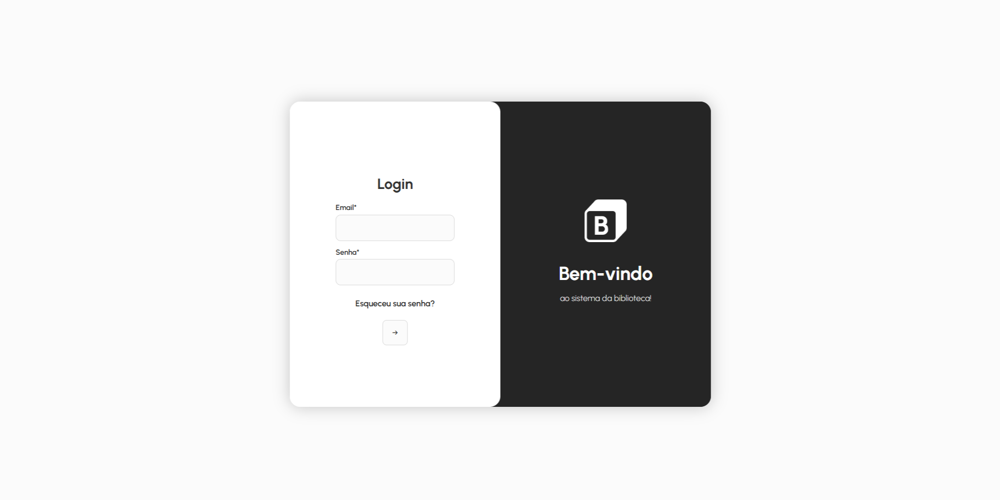
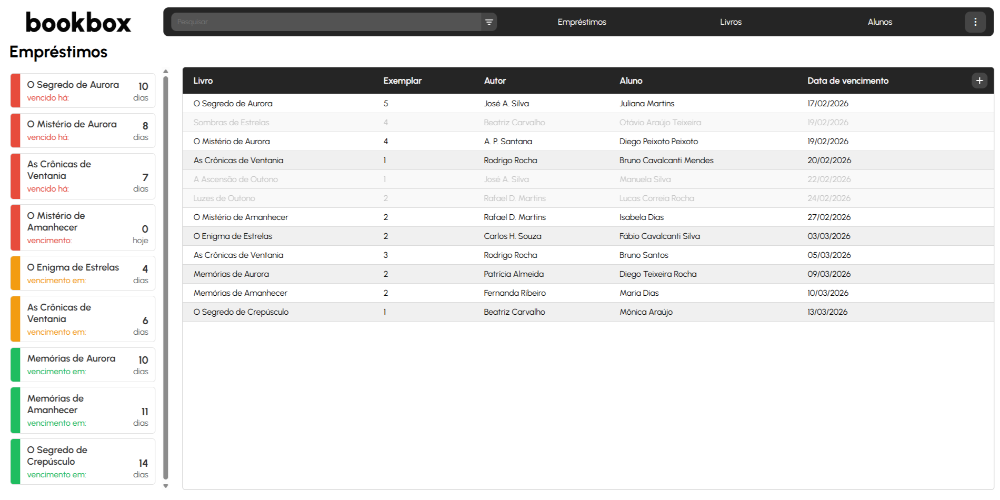
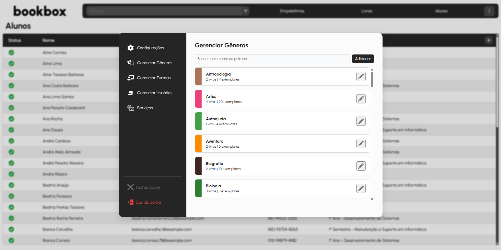
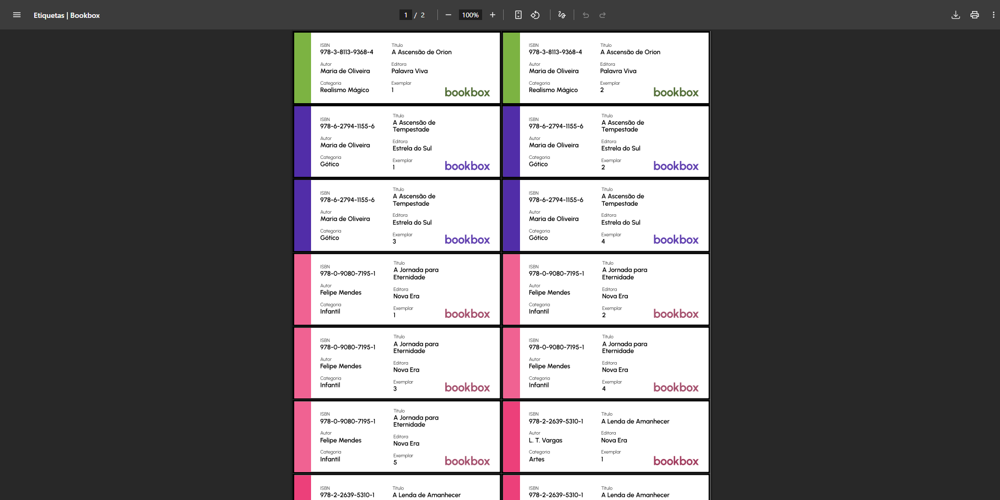

<a id="bookbox"></a>

<div align="center">


[](https://github.com/guilhermegarrote/bookbox/commits)
[](https://github.com/guilhermegarrote/bookbox)
[](https://github.com/guilhermegarrote/bookbox)

[](https://www.php.net/)
[](https://laravel.com/)
[](https://nodejs.org/)
[](https://www.npmjs.com/)
[](https://vitejs.dev/)
[](https://getcomposer.org/)
[](https://developer.mozilla.org/en-US/docs/Web/JavaScript)
[](https://pptr.dev/)

</div>

---

## 📑 Table of Contents

- [📑 Table of Contents](#-table-of-contents)
- [🌟 Overview](#-overview)
- [🔧 Features](#-features)
- [⚡ Installation](#-installation)
- [🖥️ Screenshots](#️-screenshots)
- [📖 Documentation](#-documentation)
- [📄 License](#-license)

---

## 🌟 Overview

**Bookbox** is a modern school library management system. It organizes books, students, loans, and daily operations, eliminating delays and manual errors.

Built with **Laravel**, it provides a scalable, secure, and well-integrated foundation, enabling **administrative task automation** and API-based integrations.

---

## 🔧 Features

* Book, student, and copy registration and management
* Complete loan and return control
* Copy availability lookup
* Active and overdue loan listing
* Label generation including ISBN, title, author, copy number, and barcode
* RESTful API for integrations
* Secure JWT authentication
* Modular interface components
* Automated email sending and receipt printing

---

## ⚡ Installation

1. Clone the repository:

```bash
git clone https://github.com/guilhermegarrote/bookbox.git
cd bookbox
```

2. Follow the detailed installation guide:
   [Server Installation Guide](deployment/README.md)

---

## 🖥️ Screenshots

<div align="center">






</div>

---

## 📖 Documentation

* [Installation Guide](deployment/README.md)
* [Full Documentation](https://guilhermegarrote.github.io/bookbox/page/index.html)

---

## 📄 License

MIT License © 2026 Guilherme Garrote

---

[⬆ Back to top](#bookbox)
